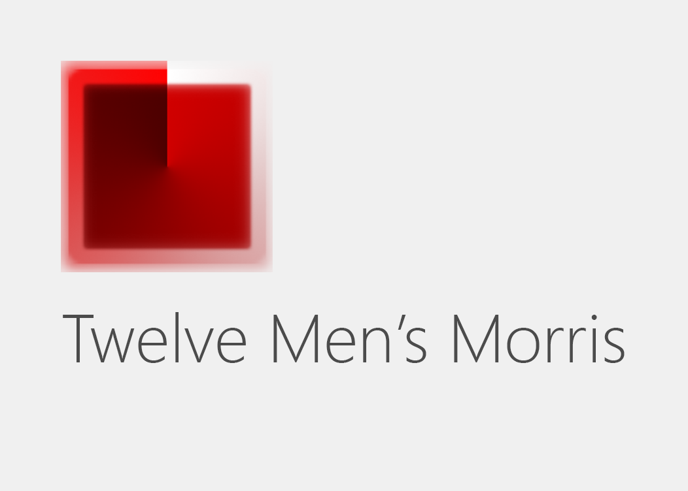

# Twelve Men's Morris — board game

Game is for two players where one of them is _AI_ (high, medium, low levels of complexity) or _real opponent_.

___

## Screenshot

## Rules

There are three main phases to the game:

- Placing the cows
- Moving the cows
- Flying the cows

### Placing the cows

- The board is empty when the game begins. Each player has 9 pieces, known as "cows"; one player has white cows and the other has black cows.
- The player with the white cows moves first.
- Each turn consists of placing a cow on an empty intersection on the board.
- The aim is to create a "mill": a row of three cows on any line drawn on the board.
- If a player forms a mill, he or she may remove or "shoot" one of the opponent's cows. The shot cow is removed from the board and not placed again. A cow in a mill may not be shot unless all of the opponent's cows are in mills, in which case any cow may be shot.
- Even if a move creates more than one mill, only one cow can be shot in a single move.

### Moving the cows

- After all the cows have been placed, each turn consists of moving a cow to an empty adjacent intersection.
- As before, completing a mill allows a player to shoot one of the opponent's cows. Again, this must be a cow which is not in a mill, unless all of the opponent's cows are in mills.
- Players are allowed to "break" their own mills.
- A mill may be broken and remade repeatedly by shuffling cows back and forth. Each time the mill is remade, one of the opponent's cows is shot. Of course, by breaking the mill the player exposes the cows which were in a mill to the risk of being shot by the opponent on his or her next turn.
- In the "Generally Accepted Rules" published by Mind Sports South Africa, a mill which is broken to form a new mill can't be formed again on the next move.

### Flying the cows

- When a player has only three cows remaining, desperate measures are called for. This player's cows are allowed to "fly" to any empty intersection, not just adjacent ones.
- If one player has three cows and the other player has more than three cows, only the player with three cows is allowed to fly.

### Finishing the game

- You win if your opponent cannot move.
- You win if your opponent has just two cows.
- If either player has only three cows and neither player shoots a cow within ten moves, the game is drawn.
- One person cheats, then the other one wins by default.

**Good game!**
